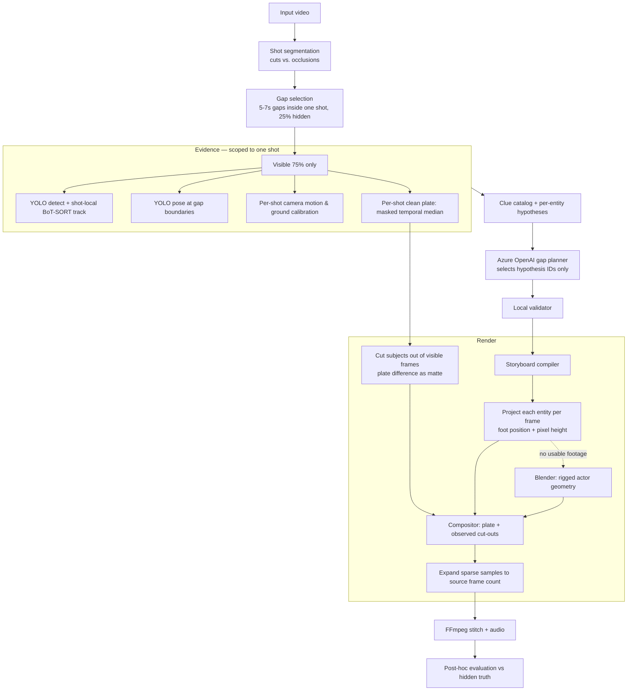

# AI-Inferred Evidence Visualization & 3D Forensic Reconstruction

Hides exactly 25% of a video, analyses only the remaining 75%, and reconstructs the
missing intervals from evidence — then stitches everything back to the original duration,
frame rate, resolution, and audio.

The output is labelled **AI-inferred forensic reconstruction, not recovered footage**,
and the system is built so that claim stays honest.

> **Nothing in a reconstructed frame is invented pixel by pixel.** The background is real
> footage recovered from the visible portion of that same shot. The people in it are real
> photographs of those same people, taken seconds earlier or later by the same camera.
> What the system infers is *where they were and when* — the geometry, not the substance.
> See [Current state](#current-state) for what that does and does not achieve.

---

## How it works



### The core idea

Only the entity classes YOLO actually detected are drawn — people, vehicles, carried
objects. Everything else in the frame is **real footage**, recovered by masking tracked
foreground and taking a per-pixel temporal median of the visible frames.

The background is the same before and after a gap, so it is recovered once and reused.
That is the design's main win: the background is photographic rather than invented, and
the system only draws what actually moved.

**"The background is the same" holds within a shot, and only within a shot.** A video
that is several clips joined together has a different camera, a different background and
a different ground plane in each one. Averaged across all of them, the recovered
background is a ghosted composite of every camera position in the file — and since that
composite becomes the background of every reconstructed frame, it is the single largest
thing that can go wrong. So the video is segmented into shots first, and the plate, the
calibration, the tracking and the gap placement are all scoped to one shot. A video with
no cuts is one shot, and costs nothing extra.

**The actors are photographs, not models.** Every entity in a gap was observed
repeatedly in the footage on either side of it. Those observations are real pictures of
the real subject, taken by the same camera under the same light, so using them sidesteps
everything that makes a synthetic figure read as synthetic — clothing, skin, hair, sensor
grain, motion blur, and the fact that a renderer and a camera never quite agree about
light. Cutting them out is nearly free because the plate has already measured what the
scene looks like empty: inside a detection box, the foreground is wherever the frame
differs from the plate.

What the reconstruction infers is therefore *geometry* — where each entity was at each
moment, and how large it should appear — while the substance stays photographic. The
rigged Blender actor remains as a fallback for entities with no usable footage.

Three details carry more weight than they look:

**One camera, derived twice.** The crop rectangle and Blender's camera both come from
[`camera_basis`](src/domain/camera_projection.py). If they were configured separately, a
couple of degrees of disagreement would put every actor outside its own crop and produce
a video of untouched background — valid output that looks like a successful run.

**Two timelines, kept apart.** A five-second gap is 150 source frames but perhaps 30
rendered samples. A keyframe is emitted at every render sample rather than at plan
waypoints, so the actor's animation and its crop rectangle cannot describe different
moments.

**Smoothness is earned, not faked.** Sparse renders are expanded back to the source
frame rate by warping along optical flow between samples, not by repeating frames.
Measured on a real gap, that took 125 of 170 frames from *identical to the previous one*
down to zero. The flow is guarded by a forward–backward consistency check, because
Farneback fails by returning a small flow rather than an error — so when a subject moves
further than it can match, the result degrades to judder instead of to a smear.

### The evidence contract

Hidden frames are unavailable to every reconstruction stage until evaluation. This
applies to pixels as much as to structured data — the clean plate samples visible
ranges only.

Post-gap observations are **soft consistency checks, never hard arrival targets**. The
path is predicted forward from pre-gap motion, and the residual against what actually
happened stays visible in the report rather than being tuned away.

### Who decides what

| Component | Authority |
|---|---|
| YOLO / tracking / calibration | what was visibly detected and measured |
| Deterministic Python | IDs, coordinates, paths, physical limits, candidate hypotheses |
| Azure OpenAI (`gpt-5.4-mini`) | **selects among** supplied hypothesis IDs and action tokens |
| Local validator | rejects anything unreferenced, out of range, or invented |
| Blender | renders — makes no inference decisions |
| Narrative pass | explains accepted decisions; cannot alter them |

Azure never returns coordinates. If it is unavailable or returns an invalid schema, a
deterministic fallback runs and is labelled as such — it never masquerades as
model-assisted reasoning.

---

## Running it locally

Two servers: a FastAPI backend that runs the pipeline, and a React interface.

```bash
python scripts/run_local.py
```

That checks Blender, FFmpeg and the prebuilt model library, then starts both and
prints the URLs. Open **http://localhost:5173**, drop in a video, and watch the
timeline, clues, storyline and renders arrive as the pipeline produces them.

To run them separately — two terminals:

```bash
python -m uvicorn interfaces.api.app:app --app-dir src --port 8000 --reload
```

```bash
cd ui && npm install && npm run dev
```

First time only, build the actor models so they are not regenerated on every run:

```bash
python scripts/build_actor_library.py
```

The backend binds loopback and is unauthenticated. It accepts video uploads and runs a
heavy pipeline over them — it is a single-user developer tool, not something to expose
on a network.

### What the interface shows

| Panel | Appears when |
|---|---|
| Timeline — the 75/25 split to scale, gaps turning green as they render | gaps are chosen |
| Clues — every tracked entity with its class, span, direction and confidence | detection finishes |
| Storyline — the narrative and the per-gap reasoning behind it | the planner runs |
| Results — recovered plate, each gap beside the footage it replaced, final video | rendering completes |

Panels fill in as the pipeline produces them rather than all at the end, because the
stream carries the artifacts themselves. On the sample clip that means the timeline
appears within seconds, then 200-odd tracked entities across eight classes, then the
storyline, then gaps turning green one at a time.

The interface is the finished part of this project; the render it displays is not.

The hidden footage is shown **only** in the results comparison, after the fact. No
reconstruction stage can read it.

## Running it elsewhere

### Google Colab (the supported path)

Open [`colab/reconstruction.ipynb`](colab/reconstruction.ipynb), set
**Runtime > Change runtime type > GPU**, then **Run all**.

The notebook is deliberately thin: it clones this repository and calls
[`colab_setup`](src/interfaces/colab_setup.py) and
[`colab_run`](src/interfaces/colab_run.py). It contains no copy of pipeline logic.
It will prompt for a video and, if Azure values are not already set as Colab secrets,
for your local `.env`, which is parsed in memory and never written to Drive.

Completed gaps are checkpointed to Drive under a content-addressed run identifier, so a
disconnected session resumes rather than restarting.

### Requirements

Python 3.12+, Blender 4.5 LTS, FFmpeg and FFprobe on `PATH`, and Node 18+ for the
interface. A discrete GPU helps but is not required — every measurement in
[Current state](#current-state) is from Intel integrated graphics.

```bash
pip install -r requirements.txt
```

`app.py` is the older single-file server, kept working but superseded by
`scripts/run_local.py`.

### Azure configuration

```env
AZURE_OPENAI_API_KEY=...
AZURE_OPENAI_BASE_URL=https://your-resource.openai.azure.com/
AZURE_OPENAI_CHAT_DEPLOYMENT=gpt-5.4-mini
```

Reasoning is optional — without it the deterministic planner runs and says so.

---

## Layout

```text
scripts/run_local.py                Starts the backend and interface together
scripts/build_actor_library.py      Builds the prebuilt actor models
config/reconstruction_config.json   All policy values
assets/actors/                      Prebuilt actor geometry (built, not committed)
ui/                                 React interface (Vite)
src/
  gap_selector.py                   Places gaps inside shots, with context each side
  domain/                           Pure logic: evidence contract, shot timeline,
                                    shot-scoped evidence, identity registry, path
                                    prediction, calibration, camera projection,
                                    actor placement and observation choice, render regions
  application/                      Orchestration: pipeline, reasoning, clean plate,
                                    plate evidence, exemplar library and renderer,
                                    compositor, actor gap renderer, actor render job
  infrastructure/                   I/O: shot segmentation, Blender service + protocol,
                                    camera motion, Azure adapter, media tools, kernel cache
  interfaces/
    api/                            FastAPI backend and artifact readers
    http/                           Legacy loopback server
    colab_setup.py, colab_run.py    Colab entry points
blender/
  service.py                        Persistent in-Blender command loop
  warm_shell.py                     Reusable per-job scene
  bench/                            M0 render-strategy benchmark
benchmarks/                         Measured render timings
tests/                              808 unit tests, 14 Blender integration tests
```

### The Blender boundary

Blender never imports business logic. It reads validated JSON contracts and owns only
`bpy` scene construction and rendering. The single shared module is the wire protocol,
and [a test](tests/unit/test_blender_service_boundary.py) enforces that it stays
stdlib-only and free of project imports.

One Blender process serves an entire job rather than one per gap, so startup, shader
compilation, and OptiX kernel compilation are paid once. On Colab the compiled kernel
cache is carried across sessions.

---

## Testing

```bash
python -m pytest
```

Integration tests drive a real headless Blender and are opt-in:

```bash
python -m pytest -m integration
```

They cover the M1 exit criteria — 200 frames across 4 gaps in one process, resume after
a mid-render kill re-rendering only missing frames, and a warm-versus-cold determinism
check proving process reuse does not change output — and the M2 ones: that a rendered
actor lands inside the crop computed for it, that shading really is confined to that
border, that the composited frame is untouched plate everywhere else, and that a gap
with **no** actors renders nothing at all.

That group is worth the render time, because the failures it catches all look like
success. A camera-convention error produces a valid video of unmodified background. A
template left visible to the camera produces a valid video with a grey block over it.
Neither trips a structural assertion; both are obvious the moment you render and look.

### Benchmarking the renderer

```bash
python scripts/run_m0_benchmark.py --label colab_t4
```

Measures actor-only ROI rendering against the full-scene baseline and reports whether
EEVEE Next can render headless on this machine. See [benchmarks/](benchmarks/README.md).

---

## Current state

### What works

The whole pipeline, verified end to end on `input_vid3.mp4` — a montage of nine takes
across two London locations, which is the hardest case for these assumptions and the one
that used to break them.

| | |
|---|---|
| End to end | **17.6 min** on Intel Iris Xe integrated graphics (10.2 min reusing cached detection) |
| Shots found | **9**, from 11 candidates — 2 correctly rejected as somebody crossing the lens |
| Gaps | 5 × 5.7–6.0 s = **25.0%** hidden, each wholly inside one take |
| Background | recovered per take, **stable in all five** (sample disagreement 2.0–4.1) |
| Camera | fitted per take, calibration confidence **0.78–0.80** |
| Actors | drawn from real photographs in **all five gaps**; no fallback to geometry |
| Output | 3493 frames, 1280×720, source frame rate and audio preserved |

Measured against the hidden footage, which no reconstruction stage is allowed to see
until evaluation:

| Diagnostic | Whole-video scope | Per-shot scope + observed actors |
|---|---|---|
| Mean SSIM | 0.422 | **0.786** |
| PSNR | 13.4 dB | **18.7 dB** |
| Boundary SSIM at gap seams | 0.428 | **0.801** |
| Person-count similarity | 0.034 | **0.451** |
| Object-count similarity | 0.015 | **0.282** |
| Normalised centre error (lower is better) | 0.979 | **0.666** |

These are diagnostics comparing an inferred scene with hidden footage, not a claim of
recovery accuracy. What they show is the effect of two changes: scoping every stage to a
single shot, and drawing actors from observation rather than from a model.

Admission, shot segmentation, gap selection, visible-only evidence, clue catalog,
planning, per-shot plate recovery, actor cut-out and compositing, the Blender fallback
through one warm process, stitching, evaluation, the live interface, and Colab execution
with Drive resume all work.

### What does not

**Crowds outrun the plate.** The background is a per-pixel median of visible frames, so a
pixel is only recovered where it was unoccupied in most of them. Outside a busy shop, it
never is. Two things are done about it, and neither is a full fix: pixels whose samples
never settle are detected — by their spread around the median, not just by how often they
were masked — and filled in from their surroundings, and the fraction that needed filling
is reported per shot as `unresolved_pixel_fraction`. On the densest shot of
`input_vid3` that is a third of the frame. Filled pavement is quietly wrong; the
half-transparent strangers it replaces looked like a reconstruction claiming somebody was
there, which is worse.

**Entities with no usable footage fall back to a mannequin.** If every sighting of an
entity is too small or too occluded to cut out, the rigged Blender actor draws it
instead: correct in position, size and gait, but plainly synthetic. The gap report
records `entities_with_footage` against `entities_planned` so this is visible rather
than inferred from how the output looks.

**A subject that turns during a gap is approximated.** Observations are matched on
apparent motion and apparent size, so a person who walks in and turns around mid-gap can
be drawn from a sighting facing the wrong way. There is no observation of a pose that was
never observed, and the system does not synthesise one.

**Moving cameras still degrade.** The plate is a temporal median and only recovers a
clean background when the camera holds still within a shot. Sample disagreement is
measured directly and surfaced as an explicit warning naming the take. Frames are not yet
warped to a reference before medianing, so a genuine pan or handheld drift inside a
single shot will still smear. Variable frame rate, sources over 10 minutes, over 120 fps,
or beyond a 4K pixel budget are rejected at admission.

**Only a third of the tracked crowd is drawn.** Gaps render 4–8 entities against 15–26
candidates on `input_vid3`. The cap is no longer the limit — confidence and relevance
thresholds are, and most of what they drop is genuinely too small or too briefly seen to
place. It still reads as a quieter street than the truth.

**Not attempted:** MPFB2 or any other photoreal human model. It was the original plan for
the actors and is now unnecessary for the common case — a photograph of the actual
subject beats a model of a generic one, and brings the scene's own light, clothing,
motion blur and grain with it. It would only improve the fallback above.

### Elsewhere in the render path

**Models are prebuilt.** `scripts/build_actor_library.py` authors every class once into
a Blender library the renderer links instead of generating, so model quality is paid for
at build time rather than per run — a far heavier figure will cost the same per gap.
The library is content-addressed over the catalog and skeleton, so rebuilt models
invalidate previously rendered layers rather than mixing two models in one video. When
absent, the renderer generates the same geometry at runtime.

Set `renderer.render_mode` to `full_scene` for the older whole-environment renderer. The
pipeline also falls back to it on its own, with the reason logged, when a gap has no
usable camera calibration or no selected entities.

**Honest about limits:** evaluation metrics compare stylised 3D against real footage.
They are internal diagnostics, not a claim of visual recovery. A single camera cannot
reveal what happened only inside a hidden interval, and the system does not pretend
otherwise.

See [Implementation_plan.md](Implementation_plan.md) for the full architecture,
performance budget, and roadmap.
